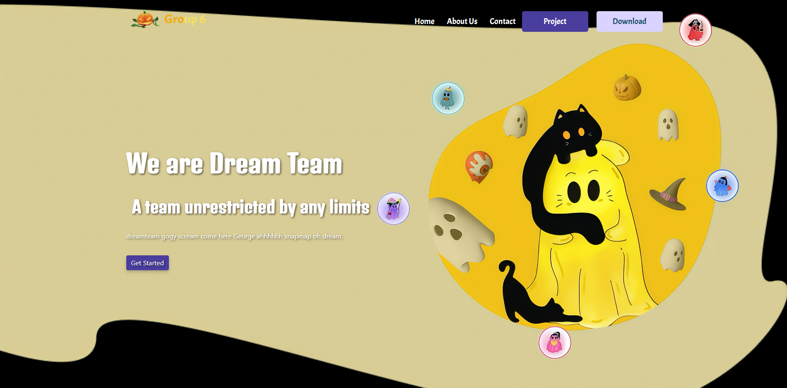

# Tic Tac Stack

A strategic evolution of traditional Tic Tac Toe, designed to eliminate frequent draws and introduce complex decision-making through an innovative stacking mechanic.

## Live Demo




Visit the live website: **[https://parichatrsaipan.github.io/tictacstack.web.github.io/](https://parichatrsaipan.github.io/tictacstack.web.github.io/)**

## Overview

A promotional website and game application that reimagines Tic Tac Toe with a strategic "Stacking" mechanic where players place higher-level characters over opponent's lower-level pieces.

## Features

- Strategic stacking mechanic with star-level characters
- Team member profiles with individual pages
- Responsive design with Bootstrap 5
- Interactive UI with smooth animations

## Technologies

HTML5 • CSS3 • JavaScript • Bootstrap 5.0 • Swiper.js

## Quick Start

```bash
# Clone the repository
git clone https://github.com/parichatrsaipan/tictacstack.web.github.io.git

# Navigate to directory
cd tictacstack.web.github.io

# Run local server (Python)
python -m http.server 8000

# Open http://localhost:8000
```

## Team Members

- **[Wawa](wawa.html)** • **[Saipan](saipan.html)** • **[Cream](cream.html)** • **[Earn](earn.html)** • **[Papa](papa.html)**

## Deployment

This project is deployed using **GitHub Pages**. Any changes pushed to the main branch will automatically update the live site at:
**[https://parichatrsaipan.github.io/tictacstack.web.github.io/](https://parichatrsaipan.github.io/tictacstack.web.github.io/)**
